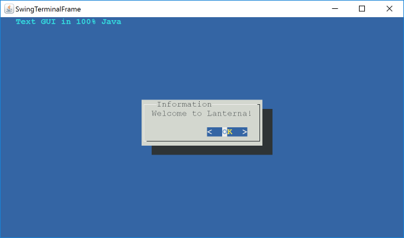

# Fun with CSV

A repository containing code that does various stuff with CSV files.
This is an IntelliJ project and has some project configurations to run the
various classes. This projects requires Java 11 as a minimum.


## CSV REPL

A simple CSV REPL program that provides two options. One to parse a
new CSV file and another to print the contents of the last parsed CSV file
in the console.

The REPL console interactions is implemented using the [JLine library](https://github.com/jline/jline3).
JLine has been chosen as it seemed to provide relevant for this simple
application while having the extensibility to plug-in advanced input handling
such as [path completion](https://github.com/jline/jline3/wiki/Completion).

The CSV parsing is done using the [FastCSV](https://github.com/osiegmar/FastCSV)
library. It is said to be a performant library as mentioned in the
["Faster processing"](#faster-processing) section below.

### Run the demo

It is ideal to run the demo by generating the shadow JAR and running the same
via an actual terminal. This ensures that features like history are available.
The following is the command to run the same:

```shell
./gradlew shadowJar && java -jar ./build/libs/fun_with_csv-1.0-SNAPSHOT-all.jar
```

Alternatively, running the REPL demo could be run in dumb terminal using the
following command:

```shell
./gradlew runCsvRepl
```

_Note_: Running the demo in dumb terminal mode could also be achieved by running it
using the IntelliJ run configuration.

#### Input path for test data

`test-data/customers-1000.csv`

### Other interesting libraries

- **[picocli](https://picocli.info/)** - a mighty tiny command line interface

  This seems to be a good option if we need to build an application that runs
  on / off the JVM.

- **[lanterna](https://github.com/mabe02/lanterna)**

  This seems to be a good option if we need to build a CLI that renders a
  text-based GUIs. Something like the following

  <details>
  <summary>Text-based GUI rendered using lanterna</summary>

  

  </details>


## Simple CSV Demo

### [CsvReaderWriter](./src/main/java/org/example/util/CsvReaderWriter.java)

A simple CSV reader / writer implementation that works well on CSV input handling
various quirks neatly.

Some related resources:
- [The Only Class You Need for CSV Files | Agile Software Craftsmanship](https://agiletribe.wordpress.com/2012/11/23/the-only-class-you-need-for-csv-files/)
- [CSV parsing in Java - working example..?](https://stackoverflow.com/a/13655640/5614968)

### [SimpleCsvDemo](./src/main/java/org/example/SimpleCsvDemo.java)

A simple demo for the `SimpleCsvReaderWriter` class. It takes in a file
path as input and prints the object constructed from the CSV data in
the console. Further gets a new file path to which the CSV data needs to
be written back.

### Run the demo

After opening the project using IntelliJ, it should be possible to run
this class using the available run configuration. Alternatively, steps
to run using Gradle is given below.

#### Run with Gradle

```shell
./gradlew runSimpleDemo
```

#### Input path for test data

`test-data/customers-1000.csv`

#### Output

You will see the `CustomerData` instances printed in the terminal.
After that, there will be a prompt to enter the output to save
the read CSV data into a file. You could enter the output path of
your choice.


## [CsvQuotes](./src/main/java/org/example/CsvQuotes.java)

Just a simple program that demonstrates how quotes need to be handled
in different scenarios in the context of a CSV file.

### Run the demo

After opening the project using IntelliJ, it should be possible to run
this class using the available run configuration. Alternatively, the following
Gradle command could be used to run this demo:
to run using Gradle is given below.

```shell
./gradlew runCsvQuotes
```


## Resources

- [RFC 4180: Common Format and MIME Type for Comma-Separated Values (CSV) Files](https://www.rfc-editor.org/rfc/rfc4180)
- [The Only Class You Need for CSV Files | Agile Software Craftsmanship](https://agiletribe.wordpress.com/2012/11/23/the-only-class-you-need-for-csv-files/)
- **Dataset**: [Download Sample CSV Files for free - Datablist](https://www.datablist.com/learn/csv/download-sample-csv-files)

### Faster processing

- [osiegmar/FastCSV: CSV library for Java that is fast, RFC-compliant and dependency-free.](https://github.com/osiegmar/FastCSV)

  [The benchmarks](https://github.com/osiegmar/FastCSV/blob/main/README.md#benchmark--compatibility)
  look interesting. It is said to be RFC 4180 compliant while outperforming many Java libraries in terms
  of the numbers of records it could process per second.

- [lemire/simdcsv: A fast SIMD parser for CSV files](https://github.com/lemire/simdcsv)

  Leverages SIMD operations to provide fast processing of CSV files. This is useful if we have
  the relevant hardware where this would perform well. This one is written in C++. 

  It might be interesting to explore similar offerings in Java. Alternatively, we could look for
  a bridge to this library.

### Other interesting stuff

- [unicode - What's the difference between UTF-8 and UTF-8 with BOM? - Stack Overflow](https://stackoverflow.com/q/2223882/5614968)
- [liquidaty/zsv: zsv+lib: tabular data swiss-army knife CLI + world's fastest (simd) CSV parser](https://github.com/liquidaty/zsv?tab=readme-ov-file)
